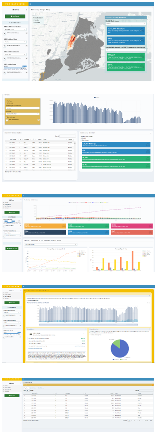

# tlc_data_hub_backend_script
Python script that ETLs data from the DuckDB repo into the TLC Data Hub RShiny App

## Check It Out

- Try a demo of the app on [DataHub].
- Open Data Week presentation here: [Open Data].
- App code is here: https://github.com/nvoevodin/tlc_data_hub_RShiny_app

## Overview

TLC Data Hub offers users a convenient location to access and visualize taxi and for hire vehicle industry data.  TLC Data Hub uses public data available on Open Data and the TLC website and does not use, track or display any private information of the drivers or companies. The Hub currently consists of three dashboards and a databank. The 'Trip Data' dashboard allows the public to run queries on TLC-collected trip data while the 'Industry Metrics' dashboard provides standard visualizations of monthly industry trends. For your convenience, there are 'Help' buttons throughout the Data Hub (shown as 'Eye' icons) that include helpful information and data explanations.

Currently, the app includes the following dashboards:

- &#x1F4C8; **Trips Dashboard** 

    The 'Trip Data' dashboard displays and compares the pickup, dropoff, trip, trip fare, trip time, and trip distance data across different locations, industries and periods.
    
    All the selections that you've made in the control panel will be represented on the map and info box. The info box allows you to switch between the monthly and daily levels of data.
    
- &#x1F4C8; **Industry Indicators Dashboard** 

    The industry metrics dashboard visualizes our monthly industry indicators published on OUR WEBSITE. These indicators cover a wide variety of topics from trips per day to the number of unique vehicles by industry sector.

- &#x1F4C8; **Fare & Earnings Dashboard** 

    The Fare Dashboard allows you to explore detailed industry fare breakdowns. We receive different financial data from different industries. In this dashboard, we reflect Yellow, Green, and High Volume FHV total and average fare information.

- &#x1F4C8; **DataBank** 

    The databank section allows you to scroll through, download, and get more familiar with the raw data used to create the dashboards.

- &#x1F4C8; **Downloadable Reports and Raw Data** 

    The DataHub allows you to download summary reports of the pages with the selections that you made in the control bar. The format of the file is 'HTML'. THe size is approx. 8mb. The reports can be further used for analyses or presentations. Additionally, you can visit the DataBank section of the app and download the raw data that we used to build this tool.

 
 

## &#x1F4C8; **Frequency of Updates & Diagrams**

The app will be updated once a month on the 25th of each month. There is a delay in us receiving and publishing data to the Open Data portal and this is reflected in the app. For example: on 26th of May the latest data on the app will be from March. Here is the whole workflow: 

 

### Overall Data Processing

**The DataBricks in the diagram mean Python, R, and other scripting to facilitate the transitions of data**
    

### DataHub Data Flow

## &#x1F64F; Thank you!

This dashboard was built using many great tools in the R ecosystem. Thanks to all of the developers of these open source packages:

- [shiny]
- [shinydashboard]
- [plotly]
- [tidyverse]
- [shinycssloaders]
- [DT]

...and many more. For a full list of project dependencies, see the Global.R file.
    
---

This dashboard was built by [Nikita Voevodin] and is owned by the NYC Government.

[Open Data]: https://www.youtube.com/watch?v=LJ8YkGjdcuA
[Nikita Voevodin]: https://nikitavoevodin.com
[DataHub]: https://tlcanalytics.shinyapps.io/datahub/
[shinydashboard-fork]: https://github.com/gadenbuie/shinydashboard/tree/dev
[adminlte-ocean-next]: https://github.com/gadenbuie/AdminLTE/tree/ocean-next
[datatable]: https://www.datatables.net/
[datatables]: https://www.datatables.net/
[app-rstudio-cloud]: https://rstudio.cloud/spaces/12362/project/258314
[app-grrrck]: https://apps.garrickadenbuie.com/rstudioconf-2019/
[app-shinyapps]: https://gadenbuie.shinyapps.io/tweet-conf-dash/
[mit-license]: https://choosealicense.com/licenses/mit/
[garrick-home]: https://www.garrickadenbuie.com
[repo]: https://github.com/gadenbuie/tweet-conf-dash/
[shiny]: http://shiny.rstudio.com/
[rtweet]: https://rtweet.info
[shinydashboard]: https://rstudio.github.io/shinydashboard/
[plotly]: https://plot.ly/
[tidyverse]: https://tidyverse.org
[shinycssloaders]: https://github.com/andrewsali/shinycssloaders
[DT]: https://rstudio.github.io/DT/
[adminlte]: https://adminlte.io/
[bootstrap]: https://getbootstrap.com/
